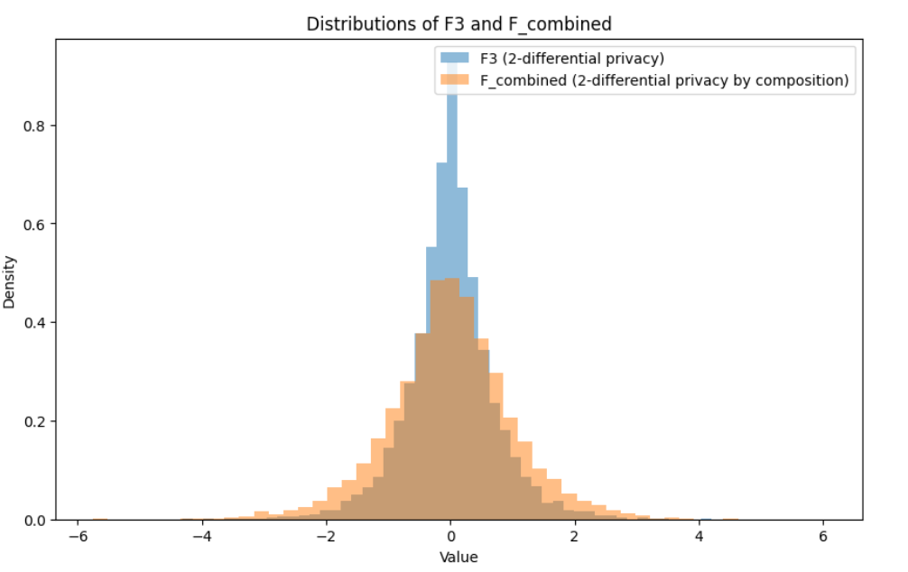

# Day 5: Exploring Differential Privacy Concepts and Applications

Today, I spent an hour exploring the foundational concepts of **Differential Privacy (DP)** by skimming through the first three chapters of the open-source book [Programming Differential Privacy](https://programming-dp.com/) by Joseph P. Near and Chiké Abuah. This quick dive touched on key DP concepts, common attacks, and essential properties, complemented by simple hands-on experiments.

---

## **Key Concepts and Attacks**

### **1. De-identification**  
While there is no formal definition for de-identification, it is commonly understood as the process of removing unique identifiers (e.g., names, email addresses, phone numbers) from a dataset. However, this alone does not guarantee privacy.

### **2. Linkage Attacks**  
A linkage attack uses overlapping information between datasets to reidentify individuals. For example:
- Combining zip codes and birth dates from two datasets can lead to identifying a specific person.  

### **3. Differencing Attacks**  
Even with aggregated data, an attacker can infer sensitive information. For instance:
- By comparing two summation queries (one including and one excluding a record), an attacker can deduce individual information.

#### **Example: Differencing Attack**
Using a dataset of ages:
```python
import pandas as pd

adult = pd.read_csv("adult_with_pii.csv")
print(adult['Age'].sum())  # Total: 1,360,144

# Exclude a specific individual
print(adult[adult['Name'] != 'Karrie Trusslove']['Age'].sum())  # Total: 1,360,088

# Infer the excluded individual's age
print(1360144 - 1360088)  # Result: 56
```
**Dataset Source**: [Adult Dataset with PII](https://github.com/uvm-plaid/programming-dp/raw/master/notebooks/adult_with_pii.csv)

---

## **Differential Privacy Properties**

### **1. Sequential Composition**
- The total privacy cost of multiple queries is the sum of the individual costs.  
- **Example**: Asking two questions that satisfy \(\epsilon=1\) and \(\epsilon=2\) results in a total privacy budget of \(\epsilon=3\).

### **2. Parallel Composition**
- Non-overlapping subsets of data can each be queried independently without increasing the total privacy cost.
- Useful for histograms or contingency tables.

### **3. Post-Processing**
- Any computation performed on the output of a DP algorithm does not weaken the privacy guarantees. This ensures safety during further analysis or visualization.

---

## **Balancing Privacy and Utility: The Role of Epsilon**

- \(\epsilon\) (epsilon) governs the trade-off between privacy and utility:
  - Smaller \(\epsilon\): Stronger privacy, but less utility.
  - Larger \(\epsilon\): Better utility, but weaker privacy.

Understanding this balance is crucial for ensuring robust yet functional AI systems. The **Sequential Composition** property illustrates how privacy costs accumulate in iterative algorithms.

---

## **Experiments**

### **1. Visualizing Sequential Composition**
Using Laplace noise to demonstrate how privacy guarantees degrade when combining multiple queries:

```python
import numpy as np
import matplotlib.pyplot as plt

epsilon1, epsilon2 = 1, 1
epsilon_total = epsilon1 + epsilon2

# Define functions satisfying DP
def F1():
    return np.random.laplace(loc=0, scale=1/epsilon1)

def F2():
    return np.random.laplace(loc=0, scale=1/epsilon2)

def F_combined():
    return (F1() + F2()) / 2

# Generate samples
samples_F_combined = [F_combined() for _ in range(10000)]

# Plot the distribution
plt.figure(figsize=(10, 6))
plt.hist(samples_F_combined, bins=50, alpha=0.5, label='F_combined (2-differential privacy by composition)', density=True)
plt.title('Sequential Composition in Differential Privacy')
plt.xlabel('Value')
plt.ylabel('Density')
plt.legend()
plt.show()
```




---

## **Podcast: Reflecting on Differential Privacy**

To make learning more engaging, I created a 15-minute podcast summarizing the chapters and key takeaways.  
Listen to the episode [here](ProgrammingDifferentialPrivacy.wav).

---

## **Conclusion**

Differential Privacy equips us with tools to protect sensitive data while enabling meaningful analysis. Understanding properties like Sequential and Parallel Composition allows us to design robust algorithms that balance privacy and utility effectively.

