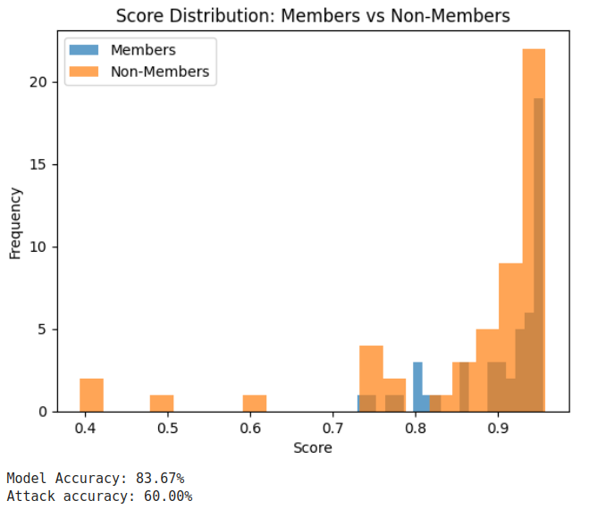
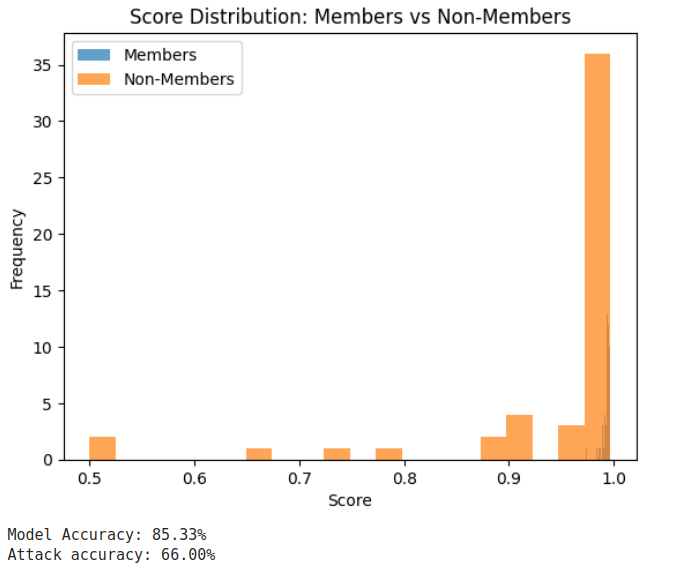

# Day 13: Membership Inference Attacks (MIA) – Experimenting with Model Privacy

Today, inspired by the paper ["Auditing Machine Learning Models for Membership Inference"](https://arxiv.org/pdf/2402.07841), I explored **Membership Inference Attacks (MIA)** by designing an experiment to evaluate the privacy risks of machine learning models. This example helped me build intuition around MIA and the balance between model performance and privacy.

Using the **AG News dataset** and a **DistilBERT classifier**, I evaluated how effectively an attacker could infer whether specific data samples were part of the training set. The results offered fascinating insights into how training configurations impact both performance and privacy.

---

## **What is Membership Inference Attack (MIA)?**

Membership Inference Attacks aim to determine whether a specific data sample was included in the training set of a machine learning model.

### **Key Concepts:**

1. **Member vs. Non-Member Scores:**
    
    - **Members (Training Samples):** The model is more confident in these, often assigning higher probabilities.
    - **Non-Members (Testing Samples):** The model tends to assign lower probabilities.
2. **Attack Accuracy:**
    
    - Measures the ability to correctly classify samples as members or non-members based on their scores.
    - Higher attack accuracy indicates a greater privacy risk, suggesting that the model memorized sensitive data.

---

## **The Experiment**

### **Dataset and Model**

1. **Dataset:** AG News (a text classification dataset).
2. **Model:** DistilBERT fine-tuned for text classification.

---

### **Full Implementation**

Below is the complete implementation of the experiment:

#### **1. Loading and Splitting the Dataset**

```python
from datasets import load_dataset
from sklearn.model_selection import train_test_split

# Load AG News dataset
dataset = load_dataset("ag_news", split="train[:1000]")  # Use a small sample for speed

# Convert the dataset into a list of dictionaries
dataset_list = [{"text": item["text"], "label": item["label"]} for item in dataset]

# Split data into training (members) and testing (non-members)
train_data, test_data = train_test_split(dataset_list, test_size=0.3, random_state=42)

# Prepare text and label lists
train_texts = [item["text"] for item in train_data]
train_labels = [item["label"] for item in train_data]
test_texts = [item["text"] for item in test_data]
test_labels = [item["label"] for item in test_data]

print(f"Training examples: {len(train_texts)}")
print(f"Testing examples: {len(test_texts)}")
```

---

#### **2. Fine-Tuning DistilBERT**

```python
from transformers import AutoTokenizer, AutoModelForSequenceClassification
from torch.utils.data import DataLoader, Dataset
import torch
import torch.nn as nn
import torch.optim as optim
from tqdm import tqdm

# Model and tokenizer configuration
model_name = "distilbert-base-uncased"
tokenizer = AutoTokenizer.from_pretrained(model_name)
model = AutoModelForSequenceClassification.from_pretrained(model_name, num_labels=4)

# Custom Dataset class
class CustomDataset(Dataset):
    def __init__(self, texts, labels, tokenizer, max_len):
        self.texts = texts
        self.labels = labels
        self.tokenizer = tokenizer
        self.max_len = max_len

    def __len__(self):
        return len(self.texts)

    def __getitem__(self, idx):
        text = self.texts[idx]
        label = self.labels[idx]
        encoding = self.tokenizer(
            text,
            truncation=True,
            padding="max_length",
            max_length=self.max_len,
            return_tensors="pt"
        )
        return {
            'input_ids': encoding['input_ids'].squeeze(0),
            'attention_mask': encoding['attention_mask'].squeeze(0),
            'label': torch.tensor(label, dtype=torch.long)
        }

# Create training and testing datasets
train_dataset = CustomDataset(train_texts, train_labels, tokenizer, max_len=128)
test_dataset = CustomDataset(test_texts, test_labels, tokenizer, max_len=128)

# Configure DataLoader
train_loader = DataLoader(train_dataset, batch_size=8, shuffle=True)
test_loader = DataLoader(test_dataset, batch_size=8)

# Device configuration
device = torch.device("cuda" if torch.cuda.is_available() else "cpu")
model = model.to(device)

# Loss function and optimizer
criterion = nn.CrossEntropyLoss()
optimizer = optim.AdamW(model.parameters(), lr=2e-5)

# Training loop
num_epochs = 2  # Change to 8 for the second part
model.train()

for epoch in range(num_epochs):
    print(f"Epoch {epoch + 1}/{num_epochs}")
    epoch_loss = 0
    for batch in tqdm(train_loader):
        input_ids = batch['input_ids'].to(device)
        attention_mask = batch['attention_mask'].to(device)
        labels = batch['label'].print(f"Model Accuracy: {accuracy * 100:.2f}%")to(device)

        optimizer.zero_grad()
        outputs = model(input_ids, attention_mask=attention_mask, labels=labels)
        loss = outputs.loss
        loss.backward()
        optimizer.step()

        epoch_loss += loss.item()
    print(f"Loss: {epoch_loss / len(train_loader)}")
```


#### Evaluation

```python
# Evaluation
model.eval()
correct = 0
total = 0

with torch.no_grad():
    for batch in test_loader:
        input_ids = batch['input_ids'].to(device)
        attention_mask = batch['attention_mask'].to(device)
        labels = batch['label'].to(device)

        outputs = model(input_ids, attention_mask=attention_mask)
        _, preds = torch.max(outputs.logits, dim=1)
        correct += (preds == labels).sum().item()
        total += labels.size(0)

accuracy = correct / total
print(f"Model Accuracy: {accuracy * 100:.2f}%")
```

---

#### **3. Membership Inference Attack Function**

```python
def membership_inference_attack(model, tokenizer, text, device):
    """
    Performs a membership inference attack on the given text.
    """
    model.eval()
    with torch.no_grad():
        encoding = tokenizer(
            text,
            truncation=True,
            padding="max_length",
            max_length=128,
            return_tensors="pt"
        )
        input_ids = encoding["input_ids"].to(device)
        attention_mask = encoding["attention_mask"].to(device)

        outputs = model(input_ids, attention_mask=attention_mask)
        probabilities = torch.nn.functional.softmax(outputs.logits, dim=-1)
        max_prob = torch.max(probabilities).item()  # Maximum probability
    return max_prob
```

---

#### **4. Evaluating the Attack**

```python
# Compute scores for training and testing texts
train_scores = [membership_inference_attack(model, tokenizer, text, device) for text in train_texts[:50]]
test_scores = [membership_inference_attack(model, tokenizer, text, device) for text in test_texts[:50]]
print(f"Model Accuracy: {accuracy * 100:.2f}%")
print(f"Member scores (training): {train_scores[:5]}")
print(f"Non-member scores (testing): {test_scores[:5]}")
```

---

#### **5. Visualizing Results**

```python
import matplotlib.pyplot as plt

plt.hist(train_scores, bins=20, alpha=0.7, label="Members")
plt.hist(test_scores, bins=20, alpha=0.7, label="Non-Members")
plt.xlabel("Score")
plt.ylabel("Frequency")
plt.legend()
plt.title("Score Distribution: Members vs Non-Members")
plt.show()
```

---

#### **6. Attack Accuracy**

```python
from sklearn.metrics import accuracy_score
import numpy as np

# Define a threshold (median of member scores)
threshold = np.median(train_scores)

# Classify test texts
predicted_labels = [1 if score > threshold else 0 for score in test_scores]
true_labels = [0] * len(test_scores)  # Assume test texts are non-members

# Compute attack accuracy
attack_accuracy = accuracy_score(true_labels, predicted_labels)
print(f"Attack accuracy: {attack_accuracy * 100:.2f}%")
```

---

### **Results**




1. **2 Epochs:**
    
    - **Model Accuracy:** 83%
    - **Attack Accuracy:** 60%
    - **Insights:**
        - Member scores were notably higher than non-member scores, indicating that the model memorized parts of the training data.
        - This memorization makes the model more vulnerable to Membership Inference Attacks (MIAs).
2. **9 Epochs:**
    
    - **Model Accuracy:** 85%
    - **Attack Accuracy:** 66%
    - **Insights:**
        - An overlap in score distributions between members and non-members was observed, suggesting that the model generalized better with additional training.
        - However, the higher attack accuracy (66%) implies that the model still exposed identifiable patterns, increasing risks for sensitive data.

---

### **Key Insights**

1. **The Trade-off Between Memorization and Privacy Risks:**
    
    - Shorter training (2 epochs) led to better separation between member and non-member scores, making the model more vulnerable to MIAs because it memorized specific training samples.
    - Longer training (9 epochs) improved the model's generalization and reduced memorization, but certain patterns persisted, resulting in even higher attack accuracy. This suggests that overtraining could amplify the attack's success in some cases.
2. **Privacy Risks Are Persistent Despite Generalization:**
    
    - While longer training generally reduces the chance of memorization, it does not entirely eliminate privacy risks. Instead, the model's outputs may still reveal subtle patterns that allow attackers to infer membership.
3. **Training Duration and Privacy Metrics Must Be Balanced:**
    
    - Fewer epochs can lead to models that are highly vulnerable due to memorization.
    - Prolonged training may inadvertently expose general patterns that attackers can exploit, underscoring the need for privacy-preserving mechanisms.

